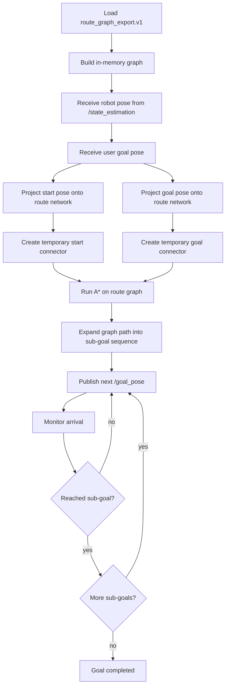
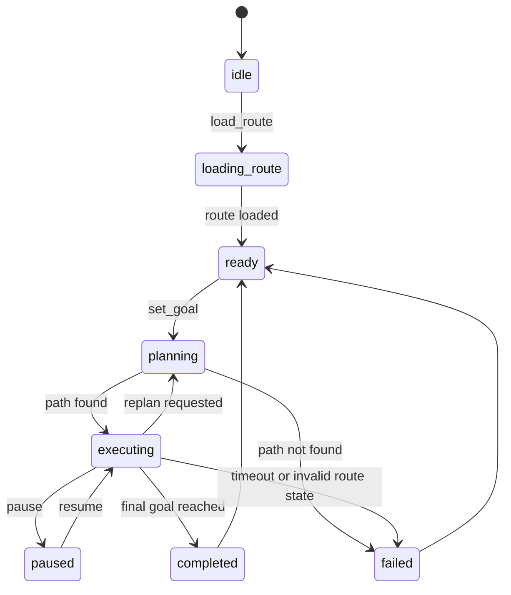

# route_network_navigator

`route_network_navigator` is the global routing layer that sits above `local_planner`.

Its job is not to generate obstacle-avoiding trajectories. Its job is to:

- load a user-authored route network exported from Route Editor v2
- project the robot start and user goal onto that network
- run A* on the route graph
- convert the resulting graph path into a sequence of short `/goal_pose` sub-goals
- hand each sub-goal to `local_planner`

This package is intentionally separate from `waypoint_example`.
`waypoint_example` is still a demo node for sequential 2D waypoints.
`route_network_navigator` is the production-facing entry point for constrained navigation on a safe route network.

## Scope

This package assumes:

- `far_planner` is not used
- `local_planner` remains the only runtime local navigation module
- Route Editor exports `route_graph_export.v1`
- the route network is the authoritative traversable skeleton

This package does not:

- replace `local_planner`
- generate dense local paths itself
- perform exploration
- require `polyline` editing

## Runtime Model

There are three distinct concepts:

1. `route waypoint`
   A graph node authored in Route Editor.
2. `route edge`
   A traversable connection between graph nodes with direction and cost metadata.
3. `user goal`
   An arbitrary target pose requested at runtime. It does not need to already be a route waypoint.

The package should treat Route Editor output as a navigation network, not as a pre-baked ordered task list.

## High-Level Flow



## Core Responsibilities

### 1. Route Loading

Input file:

- `format_version = route_graph_export.v1`

Required runtime fields:

- `frame_id`
- `waypoints[].id`
- `waypoints[].pose`
- `waypoints[].arrival_tolerance_xy`
- `waypoints[].arrival_tolerance_yaw`
- `edges[].id`
- `edges[].from_waypoint_id`
- `edges[].to_waypoint_id`
- `edges[].enabled`
- `edges[].direction`
- `edges[].speed_limit_mps`
- `edges[].slope_type`
- `edges[].max_slope_deg`
- `edges[].risk_level`

The loader should normalize the file into:

- `waypoint_by_id`
- `adjacency list`
- `edge_by_id`

### 2. Graph Search

The route network is searched with A*.

Recommended node expansion rule:

- ignore disabled edges
- respect `direction`
- optionally reject edges above a configured `max_allowed_slope_deg`
- optionally reject edges above a configured `max_allowed_risk`

Recommended edge cost:

`cost = length_m * slope_weight * risk_weight`

Suggested default weights:

- `flat = 1.0`
- `ramp = 1.15`
- `slope_transition = 1.3`
- `risk low = 1.0`
- `risk medium = 1.2`
- `risk high = 1.6`

Heuristic:

- Euclidean distance in `xy`

### 3. Start/Goal Projection

The robot pose and runtime goal should not be required to match existing route waypoints.

Instead:

- project the robot pose onto the nearest valid route waypoint or edge
- project the user goal pose onto the nearest valid route waypoint or edge
- create temporary connectors if the best projection lies on an edge interior

The first implementation can simplify this:

- stage 1: snap both start and goal to nearest waypoint only
- stage 2: upgrade to edge projection

This lets the package become usable quickly without blocking on geometric insertion logic.

## Navigation Execution Model

The package plans globally on the route graph, then executes locally by publishing one `/goal_pose` at a time.

Execution path:

```mermaid
flowchart LR
    A[Robot current pose] --> B[Snap to route graph]
    C[User target pose] --> D[Snap to route graph]
    B --> E[A* on route network]
    D --> E
    E --> F[Route waypoint sequence]
    F --> G[Sub-goal 1]
    G --> H[/goal_pose]
    H --> I[local_planner]
    I --> J[/autonomy_stack/path]
    J --> K[Robot motion]
    K --> L[Arrival check]
    L --> M[Sub-goal 2 ...]
```

Execution phases:

1. `approach_entry`
   Move from current robot pose to the first selected route waypoint.
2. `follow_route`
   Traverse internal route waypoints one by one.
3. `leave_route`
   Move from the last selected route waypoint to the final requested target pose.

For the first version, phases 1 and 3 may be simplified into:

- send the first snapped waypoint
- traverse route waypoints
- send the final user goal

## ROS Interfaces

### Subscriptions

- `/state_estimation` `nav_msgs/msg/Odometry`
- `/autonomy_stack/path` `nav_msgs/msg/Path`

### Publications

- `/goal_pose` `geometry_msgs/msg/PoseStamped`
- `/route_network_navigator/status` `std_msgs/msg/String`
- `/route_network_navigator/path_markers` `visualization_msgs/msg/MarkerArray`

### Services

First implementation can use `std_srvs/srv/Trigger` plus parameters.
Final form should use custom services.

Recommended final services:

- `load_route`
- `set_goal`
- `cancel_goal`
- `pause`
- `resume`
- `clear_route`

### Parameters

- `route_file`
- `goal_publish_rate_hz`
- `arrival_check_rate_hz`
- `replan_on_goal_update`
- `allow_goal_snap_to_edge`
- `max_goal_snap_distance_m`
- `max_start_snap_distance_m`
- `default_frame_id`
- `path_progress_timeout_sec`
- `xy_reach_fallback`
- `yaw_reach_fallback`
- `enable_visualization`

## Internal State Machine



State data should include:

- current route graph id
- current goal pose
- snapped start waypoint id
- snapped goal waypoint id
- planned waypoint sequence
- current sub-goal index
- current sub-goal pose
- last progress time
- last progress distance

## Arrival Logic

Sub-goal completion should use waypoint tolerances from the route export.

Recommended rule:

- `xy_error <= arrival_tolerance_xy`
- `yaw_error <= arrival_tolerance_yaw`

If yaw is not yet reliable enough, version 1 may degrade to:

- require `xy`
- log `yaw`
- do not block on `yaw`

Final goal completion should use:

- route exit waypoint reached
- then runtime user goal reached

## Suggested File Layout

```text
route_network_navigator/
  CMakeLists.txt
  package.xml
  README.md
  config/
    route_network_navigator.yaml
  launch/
    route_network_navigator.launch.py
  include/route_network_navigator/
  src/
```

## Recommended Implementation Phases

### Phase 1

- load route export JSON
- build graph adjacency
- snap start and goal to nearest waypoint
- run A*
- publish sequential `/goal_pose`
- track arrival using odometry

### Phase 2

- add route visualization markers
- add cancel and pause
- add progress timeout
- expose current route status

### Phase 3

- support start and goal projection onto edge interior
- inject temporary graph nodes
- improve cost model using slope and risk
- support route invalidation and replan

## Immediate Next Step

The next code task should be:

- create `route_network_navigator_node.cpp`
- implement JSON loading for `route_graph_export.v1`
- implement in-memory graph and A*
- implement waypoint-by-waypoint `/goal_pose` execution loop
